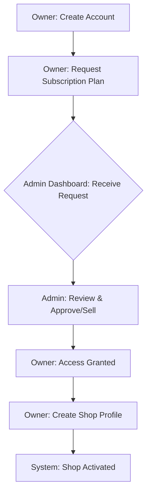
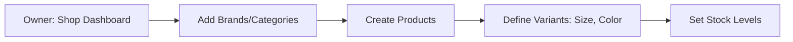
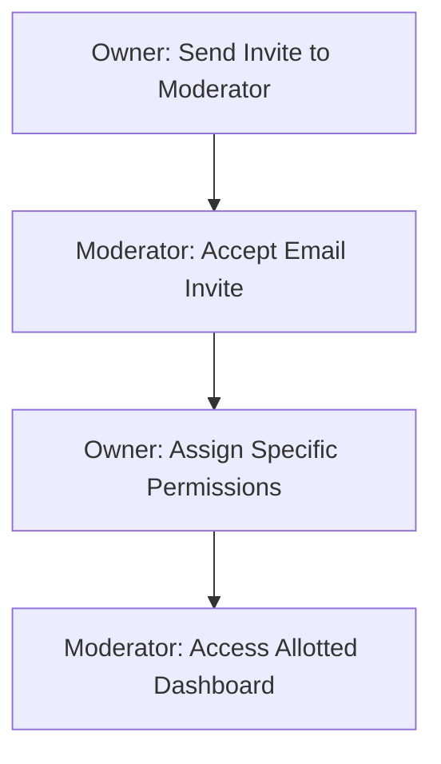
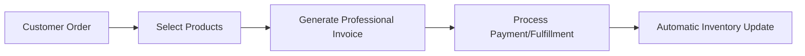

# Invoice Managerium: User Flow Guide 🔄

This guide outlines the step-by-step operational flows for **Super Admins**, **Shop Owners**, and **Moderators**. It visualizes the lifecycle from account creation to daily business management.

---

## 🚀 1. The Onboarding & Subscription Flow
*How a new business joins the platform.*

### Steps:
1.  **Account Creation**: Shop Owner registers with their email and business details.
2.  **Plan Selection**: Owner chooses a subscription plan (e.g., Basic, Pro, Enterprise) based on their needs.
3.  **Approval Queue**: The request appears on the **Super Admin** dashboard.
4.  **Sales Approval**: The **Super Admin** verifies the request and "sells" the subscription by clicking **Approve**.
5.  **Shop Setup**: Once approved, the Owner can finalize their Shop profile (Logo, Name, Currency).

---

## 🛠 2. Setup & Inventory Management
*Preparing the digital storefront.*

### Steps:
1.  **Definitions**: Owner adds Brands and Categories to keep the shop organized.
2.  **Product Entry**: Owner adds products, providing descriptions and pricing.
3.  **Variant Configuration**: For complex items, the Owner defines variants (e.g., a "Shirt" with "M" and "L" sizes).
4.  **Stock Control**: Initial inventory levels are set.

---

## 👥 3. Team Collaboration Flow
*Delegating tasks to Moderators.*

### Steps:
1.  **Invite**: The Owner invites a team member using their email.
2.  **Acceptance**: The Moderator joins the shop via the invitation link.
3.  **Permission Mapping**: The Owner grants specific rights (e.g., "Can Create Invoices", "Can Manage Products").
4.  **Unified Operation**: Both Owner and Moderator can now work together in real-time.

---

## 📄 4. Daily Operational Flow (Moderator/Owner)
*The core business engine.*

### Steps:
1.  **Sales Point**: A customer places an order.
2.  **Invoicing**: The Moderator (or Owner) selects the products and generates a PDF/Digital invoice.
3.  **Fulfillment**: The order is marked as fulfilled once payment is processed.
4.  **Auto-Sync**: The system automatically deducts stock levels across all variants.

---

## 🔥 Key Benefits of this Flow
- **Security**: Admins control the gate (subscriptions), and Owners control their staff (moderators).
- **Efficiency**: No manual stock tracking; the system handles the math.
- **Scalability**: Add more shops or staff as your business grows.

---
*© 2026 Invoice Managerium. Operational Excellence Simplified.*
